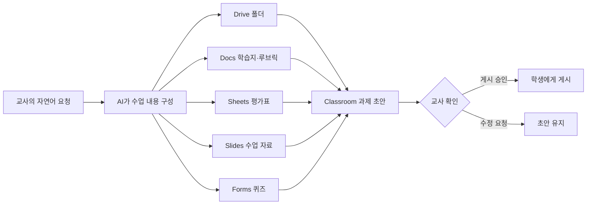

# 교육자를 위한 실제 활용 예시

`edu-workspace-mcp`는 AI가 기존 교육 자료와 학습 현황을 읽고 분석하며, 그 결과를 Google Workspace 파일과 Classroom 과제 초안으로 만드는 연결 도구입니다.

아래 예시는 정식 버전 `1.0.0`에서 안정적으로 지원하는 도구만 사용합니다. 예시의 학생 이름과 수업 정보는 모두 가상 데이터입니다.

## 한눈에 보는 업무 흐름



Classroom 게시와 Drive 공유는 생성과 분리되어 있습니다. AI는 먼저 초안과 대상을 보여 주고, 교사가 확인한 뒤에만 게시·공유 도구를 호출합니다.

## 예시 1. 한 차시 수업 패키지 만들기

### 교사가 입력할 프롬프트

> 5학년 과학 ‘소화와 순환’ 수업 패키지를 만들어줘. 교사용 수업안과 학생용 학습지는 Google Docs로, 6장 수업 자료는 Slides로, 객관식 4문항과 단답형 1문항은 Google Forms 퀴즈로 만들어줘. Drive에 ‘5학년 과학/소화와 순환’ 폴더를 만들고 모두 넣어줘. 마지막에는 ‘5학년 3반 과학’ Classroom 과제 초안으로 연결하되, 학생에게 게시하기 전 반드시 나에게 확인받아줘.

### 만들어지는 결과

```text
5학년 과학/소화와 순환/
├── 소화와 순환 교사용 수업안 (Google Docs)
├── 소화와 순환 학생용 학습지 (Google Docs)
├── 소화와 순환 수업 자료 (Google Slides)
└── 소화와 순환 형성평가 (Google Forms Quiz)

Google Classroom
└── 소화와 순환 형성평가 및 학습지 [DRAFT]
```

### MCP 도구 흐름

1. `workspace_get_auth_status`
2. `classroom_list_courses`
3. `drive_create_folder`
4. `docs_create_document` 2회
5. `slides_create_presentation`
6. `forms_create_quiz`
7. `classroom_create_assignment_draft`
8. 교사가 수업·마감·첨부 링크를 확인
9. `classroom_publish_assignment`

실행 가능한 모의 통합 테스트는 [`src/tests/education-demo.test.ts`](../src/tests/education-demo.test.ts)에 있습니다.

## 예시 2. 과정중심평가 체크표 만들기

### 교사가 입력할 프롬프트

> 5학년 3반 24명의 과정중심평가 관리 시스템을 Google Sheets로 만들어줘. 국어·사회·수학·실과·음악·미술을 포함하고, 평가 수준은 매우잘함·잘함·보통·노력요함으로 해줘. 실제 이름 대신 학생01부터 학생24까지 사용해줘.

### 만들어지는 시트

| 탭 | 역할 |
| --- | --- |
| `안내` | 학급·학년도·학기와 사용 순서 |
| `학생명단` | 번호·이름·재학 여부 |
| `평가계획` | 교과·성취기준·평가명·유형·일자·만점 |
| `평가기록` | 학생별 점수·수준·관찰·피드백 입력 |
| `학생별현황` | 평가·과제 기록과 제출률 자동 집계 |
| `제출현황` | 과제별 제출·지각·점수·확인 기록 |
| `관찰기록` | 학습·생활·관계·정서 관찰과 후속 조치 |
| `대시보드` | 교과별 평균과 수준별 분포 차트 |
| `설정` | 교과·평가 수준·유형 등 드롭다운 원본 |

`education_create_assessment_tracker`가 위 구조를 한 번에 만듭니다. 드롭다운, 체크박스, 날짜·점수 검증, 조건부 서식, 수식 연결, 차트와 설정 탭 보호 경고를 포함합니다. 학생 이름은 생성된 시트에만 기록되고 MCP 응답에는 반복하지 않습니다.

## 예시 3. 수행평가 루브릭과 자기평가지 만들기

### 교사가 입력할 프롬프트

> 6학년 국어 토론 수행평가를 준비해줘. ‘주장의 명확성’, ‘근거의 타당성’, ‘경청과 반응’, ‘말하기 태도’의 4개 기준을 4수준 루브릭으로 작성해서 Google Docs로 만들고, 같은 기준을 학생 자기평가용 Google Forms 문항으로 만들어줘. 두 파일은 ‘6학년 국어 수행평가’ Drive 폴더에 넣어줘.

### 활용 도구

- `drive_create_folder`: 평가 자료 폴더 생성
- `docs_create_document`: 교사용 루브릭 생성
- `forms_create_quiz`: 자기평가 폼 생성

Forms 생성 도구는 객관식, 단답형, 서술형을 지원합니다. 생성 이후에는 문항 구조와 응답·점수를 읽어 분석할 수 있습니다. 선형 배율이나 체크박스 그리드의 신규 생성은 향후 확장 대상입니다.

## 예시 4. 안전한 Classroom 과제 배포

### 교사가 입력할 프롬프트

> ‘5학년 3반 과학’ 수업을 찾아서 ‘우리 몸의 기관 조사’ 과제 초안을 만들어줘. 만점은 20점이고 마감은 2026년 9월 11일 오후 6시야. 조사 방법과 제출 기준을 설명에 넣고, 방금 만든 학습지 링크를 첨부해줘. 아직 게시하지는 마.

AI는 수업 목록을 먼저 확인하고 `DRAFT` 상태로 과제를 만듭니다. 초안 결과에는 게시용 일회성 승인 ID가 포함됩니다.

게시할 때는 다음처럼 명시적으로 요청합니다.

> 수업, 제목, 마감, 첨부 자료가 맞아. 게시해줘.

승인 ID는 15분 동안 한 번만 사용할 수 있습니다. 같은 승인 ID로 중복 게시하는 것은 차단됩니다.

## 예시 5. 학기 자료 폴더 정리

### 교사가 입력할 프롬프트

> Drive에서 이름에 ‘2학기 수행평가’가 들어간 파일을 찾아 종류별로 보여줘. 그다음 ‘2026/5학년/2학기 수행평가’ 폴더를 만들어줘. 파일 이동은 하지 말고 먼저 검색 결과와 새 폴더 링크만 알려줘.

이 흐름은 `drive_search_files`와 `drive_create_folder`를 사용합니다. `1.0.0`에는 기존 파일 이동 도구가 없으므로 검색과 폴더 생성까지만 수행합니다.

## 예시 6. 동료 교사와 자료 공유

### 교사가 입력할 프롬프트

> 방금 만든 수업안 문서를 `teacher@example.edu`에게 댓글 작성자 권한으로 공유할 준비를 해줘. 아직 공유하지 말고 대상과 권한을 먼저 보여줘.

1. `drive_prepare_share`가 공유 대상과 권한을 정리하고 승인 ID를 만듭니다.
2. 교사가 내용을 확인합니다.
3. `drive_share_file`이 승인된 내용과 정확히 일치할 때만 권한을 추가합니다.

지원 권한은 읽기, 댓글, 편집이며 사용자·그룹·도메인·링크 공개 대상을 지정할 수 있습니다.

## 예시 7. 기존 수업 자료 요약·재구성

### 교사가 입력할 프롬프트

> 이 Google Docs 수업안과 Google Slides 자료를 읽어 핵심 학습 목표, 활동 순서, 준비물을 정리해줘. 두 자료에서 내용이 다른 부분도 알려주고, 그 결과로 학생용 복습 문제 5개를 만들어줘.

`docs_read_document`는 표와 여러 문서 탭을 포함한 본문을, `slides_read_presentation`은 슬라이드별 텍스트·표·발표자 노트를 읽습니다. 기존 자료를 읽으려면 설치와 로그인에 `--read`가 필요합니다.

## 예시 8. 형성평가와 미제출 현황 확인

### 교사가 입력할 프롬프트

> 이 Google Forms 형성평가의 문항과 응답을 읽어 문항별 정답률과 오개념을 정리해줘. 이어서 5학년 3반 Classroom의 해당 과제 제출 현황을 확인하고, 아직 제출하지 않은 학생은 표로 보여줘. 학생에게 메시지를 보내지는 마.

이 흐름은 `forms_read_form`, `forms_list_responses`, `classroom_list_coursework`, `classroom_list_students`, `classroom_list_student_submissions`를 사용합니다. 읽기 도구만 호출하므로 Google 자료를 수정하거나 학생에게 알림을 보내지 않습니다.

## 예시 9. Classroom 제출 현황을 대시보드로 만들기

### 교사가 입력할 프롬프트

> ‘5학년 3반 과학’ Classroom에서 ‘분수의 곱셈 형성평가’ 과제를 찾아 학생별 제출·지각·점수 현황을 새 Google Sheets 대시보드로 만들어줘. 학생에게 메시지를 보내거나 과제를 변경하지는 마.

`education_create_classroom_submission_tracker`는 학생 명단과 해당 과제의 제출물을 읽어 `학생명단`, `제출현황`, `대시보드`가 연결된 스냅샷을 만듭니다. Classroom 사용자 ID는 학생을 매칭하는 동안에만 사용하고 결과 시트에는 저장하지 않습니다. 최신 상태를 반영하려면 새 스냅샷을 만들어야 하며 `--read` 로그인이 필요합니다.

## 예시 10. 개인정보를 읽지 않고 복잡한 시트 점검하기

### 교사가 입력할 프롬프트

> 이 업무용 Google Sheets의 학생 이름·점수·기록 내용은 보여주지 말고, 탭 구조와 수식 함수, 탭 사이 의존성, 깨진 수식 위치, 드롭다운·체크박스·조건부 서식·차트 수만 점검해줘.

`sheets_inspect_workbook`은 셀 값과 수식 본문을 반환하지 않습니다. 대신 탭별 행·열 크기, 숨김 여부, 많이 쓰는 함수명과 개수, 시트 간 참조, `#REF!` 같은 오류 위치, 데이터 검증·차트·보호 범위 수를 제공합니다. 탭 제목과 오류 셀 주소는 구조 파악을 위해 반환되므로 결과를 공개 저장소에 올리기 전 한 번 더 확인하세요.

## 복사해서 테스트할 수 있는 짧은 프롬프트

### Google Docs

> 초등학교 5학년 학생용 ‘온라인 예절’ 활동지를 Google Docs로 만들어줘. 학습 목표, 상황 사례 3개, 모둠 토의 질문 4개, 자기 점검 항목을 포함해줘.

### Google Sheets

> 학생01부터 학생10까지 사용할 독서 기록장을 Google Sheets로 만들어줘. ‘독서기록’, ‘월별현황’, ‘설정’ 탭을 만들고 날짜, 책 제목, 저자, 읽은 쪽수, 한 줄 감상을 기록하게 해줘.

### Google Slides

> 4학년 사회 ‘우리 지역의 문화유산’ 도입 수업 자료를 7장 Google Slides로 만들어줘. 문제 상황, 학습 목표, 탐구 질문, 활동 순서, 정리 질문을 포함해줘.

### Google Forms

> 5학년 수학 ‘분수의 곱셈’ 형성평가를 Google Forms 퀴즈로 만들어줘. 객관식 4문항과 단답형 2문항으로 구성하고 정답과 배점을 넣어줘.

### Google Classroom

> 내가 담당하는 활성 Classroom 수업을 보여주고, 선택한 수업에 ‘분수의 곱셈 형성평가’ 과제를 초안으로 만들어줘. 게시 전에는 반드시 확인받아줘.

## 현재 버전에서 가능한 범위

| 기능 | 1.0.0 상태 |
| --- | --- |
| Drive 파일 검색·폴더 생성 | 지원 |
| 새 Docs 문서와 본문 블록 생성 | 지원 |
| 여러 탭·초기 행·수식이 있는 새 Sheets 생성 | 지원 |
| 제목·본문 중심의 새 Slides 생성 | 지원 |
| 객관식·단답형·서술형 Forms 퀴즈 생성 | 지원 |
| 교사가 담당하는 활성 Classroom 수업 조회 | 지원 |
| 기존 Docs 본문·표·문서 탭 읽기 | 지원 (`--read`) |
| 기존 Sheets 탭·셀 값 읽기 | 지원 (`--read`) |
| Sheets 구조·함수·의존성·수식 오류 비노출 진단 | 지원 (`--read`) |
| 과정중심평가 9개 탭·대시보드 템플릿 생성 | 지원 |
| Classroom 제출 현황 대시보드 스냅샷 생성 | 지원 (`--read`) |
| 기존 Slides 텍스트·표·발표자 노트 읽기 | 지원 (`--read`) |
| Forms 문항·응답·점수 읽기 | 지원 (`--read`) |
| Classroom 과제·학생 명단·제출 상태·점수 읽기 | 지원 (`--read`, 과제·제출은 기본 Classroom 범위 포함) |
| Classroom 과제 초안과 승인 후 게시 | 지원 |
| 승인 후 Drive 공유 권한 추가 | 지원 |
| 기존 Docs·Sheets·Slides 부분 편집 | 미지원 |
| 교육용 템플릿의 차트·드롭다운·체크박스·조건부 서식 | 지원 |
| 기존 Sheets 임의 범위에 대한 범용 차트·검증·서식 편집 | 미지원 |
| Gmail·Calendar 연동 | 미지원 |

## 공개 데모를 만들 때 지켜야 할 점

- 실제 학생 이름, 이메일, 성적, 상담 기록은 저장소나 스크린샷에 넣지 않습니다.
- 데모는 가상 학급과 테스트용 Classroom에서 실행합니다.
- Classroom 과제는 초안 상태까지 자동으로 만들고 게시 직전에 사람이 확인합니다.
- `anyone` 공유를 예시 기본값으로 사용하지 않습니다.
- GitHub 이슈에 OAuth 토큰, client secret, 파일 ID가 포함된 로그를 올리지 않습니다.
